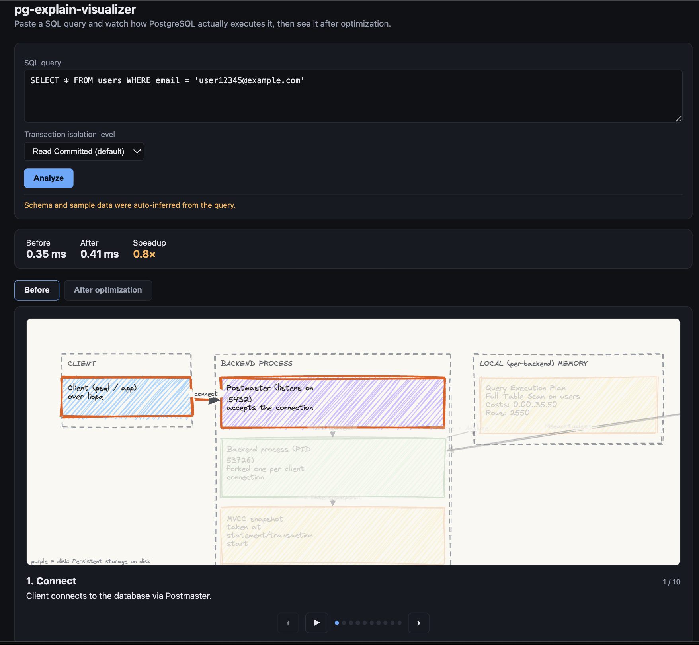

# pg-internals-visualizer

Paste a SQL query and watch how PostgreSQL actually executes it: a
slideshow of the real process/memory/disk internals (parsing, planning,
buffer pool, WAL, MVCC visibility, and so on), grounded in a real `EXPLAIN
(ANALYZE, BUFFERS)` run against a disposable Postgres sandbox. It also
recommends one simple optimization (typically an index), applies it for
real, and shows a second "after" slideshow so you can see the difference.

Two goals: help developers curious about what a database actually does
when it receives a query (like an educator, not just a plan-cost table),
and surface simple, concrete performance wins.

Everything runs locally — Ollama for the LLMs, Docker for the sandbox
Postgres — no external API calls.

## Setup

```bash
# 1. Install and pull the local model
brew install ollama
ollama pull qwen2.5-coder:14b
ollama pull nomic-embed-text

# 2. Set up the project
python3.13 -m venv .venv
source .venv/bin/activate
pip install -r requirements.txt
cp .env.example .env

# 3. Build the knowledge base (one-time)
python knowledge/scrape_interdb.py
python knowledge/build_index.py

# 4. Start the sandbox Postgres
docker compose up -d

# 5. Run the app
uvicorn server.main:app --reload
```

Open http://localhost:8000, paste a SQL query, and click Analyze. This
pipeline genuinely takes several minutes — progress streams in as it goes,
so a quiet wait isn't a stuck one.

## Screenshots


