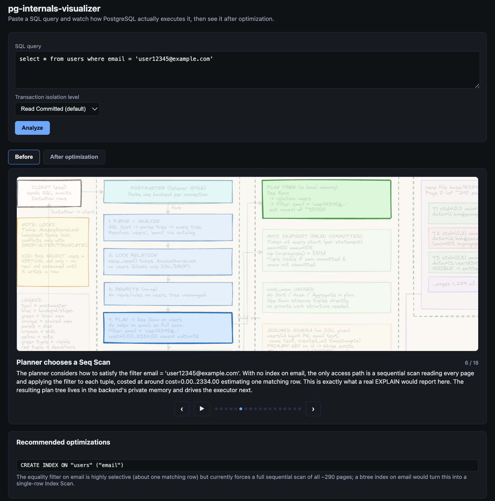
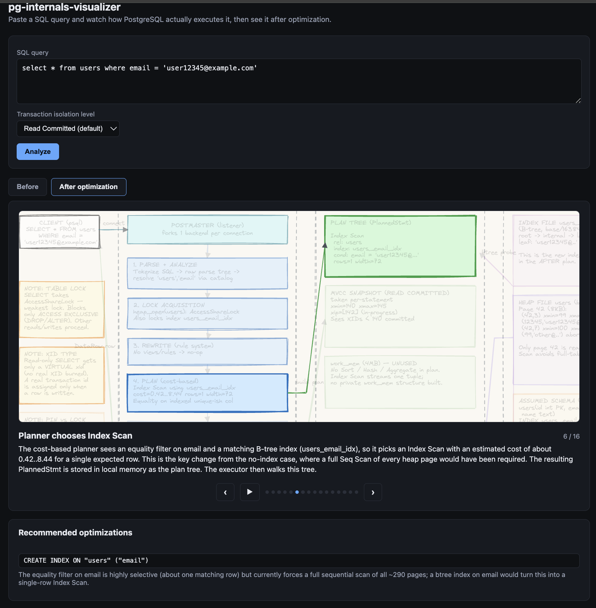

# pg-internals-visualizer

Paste a SQL query and watch how PostgreSQL actually executes it: a
slideshow of the real process/memory/disk internals (parsing, planning,
lock acquisition, buffer pool, WAL, MVCC visibility, and so on). A single
Claude model reasons out a realistic EXPLAIN plan for your query (no
database, Docker, or sandbox involved) and draws the whole diagram +
slideshow itself. It also recommends one simple optimization (typically an
index) and shows a second "after" slideshow reasoning through the
optimized plan.

Two goals: help developers curious about what a database actually does
when it receives a query (like an educator, not just a plan-cost table),
and surface simple, concrete performance wins.

## Setup

```bash
python3.13 -m venv .venv
source .venv/bin/activate
pip install -r requirements.txt
cp .env.example .env
# then edit .env and set ANTHROPIC_API_KEY (console.anthropic.com -> API Keys)

uvicorn server.main:app --reload
```

Open http://localhost:8000, paste a SQL query, and click Analyze. This can
take several minutes — progress streams in as it goes, so a quiet wait
isn't a stuck one.

## Screenshots




